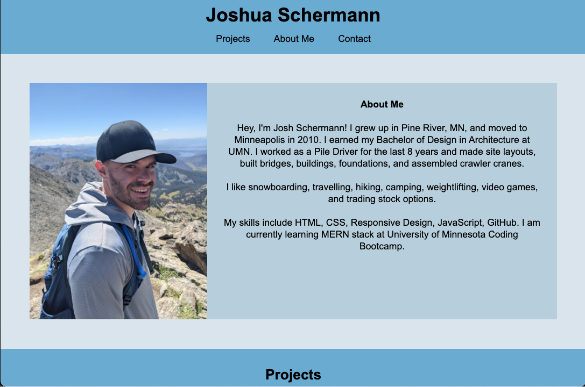

# Portfolio

This is a showcase for all my development projects. I utilized what I learned about HTML and CSS to present all my completed projects as well as one work-in-progress.

I utilized media breakpoints to create a responsive design. The portfolio offers brief descriptions as well as links to my project deployments.

## Deployment

https://josh2100.github.io/portfolio/

## Screenshot

